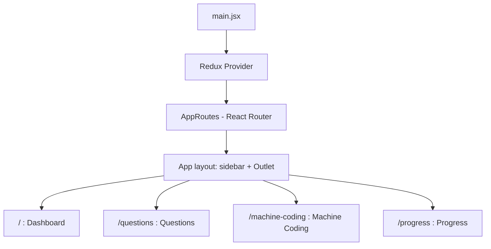
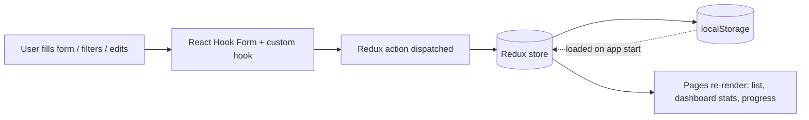

# Interview Practice Tracker

A weekly progress tracker for interview preparation. Log the questions you practice (DSA, Git, Technical) and your machine coding tasks, filter them, update their status, and see your overall progress on a dashboard. Everything is stored in your browser, so there is no backend or login.

Built with **React 19, Vite, Redux Toolkit, React Router, React Hook Form and Tailwind CSS**.

---

## Features

- **Dashboard**: a summary page with a hero card, a machine coding card, a grid of stat cards and a list of recent questions.
- **Questions tracker**
  - Add a question with a title, category (`DSA`, `Git`, `Technical`), difficulty (`Easy`, `Medium`, `Hard`) and status (`Pending`, `In Progress`, `Completed`).
  - Form validation (title is required, minimum 3 characters).
  - Edit and update existing questions.
  - Filter by status, category and difficulty, plus a search box.
- **Machine coding tracker**: add, update and list machine coding tasks, with their own stats and filters (status, difficulty, search).
- **Progress page**: overall completion, progress per category and progress per status.
- **Persistent data**: questions and machine coding tasks are saved to `localStorage`, so they are still there after a refresh.
- **Responsive UI**: sidebar navigation on desktop, bottom navigation bar on mobile, with a dark theme.

---

## Tech Stack

| Purpose | Tool |
| --- | --- |
| UI library | React 19 |
| Build tool / dev server | Vite |
| State management | Redux Toolkit + React Redux |
| Routing | React Router |
| Forms and validation | React Hook Form |
| Styling | Tailwind CSS v4 (`@tailwindcss/vite`) |
| Icons | lucide-react |
| Linting | ESLint |

---

## Setup

**Prerequisites:** Node.js (current LTS recommended) and npm.

```bash
# 1. Clone the repository
git clone https://github.com/clay-0101/Weekly-Progress-Tracker.git
cd Weekly-Progress-Tracker

# 2. Install dependencies
npm install

# 3. Start the dev server
npm run dev
```

Open the local URL that Vite prints in the terminal (usually `http://localhost:5173`).

### Available scripts

| Command | What it does |
| --- | --- |
| `npm run dev` | Starts the development server with hot reload |
| `npm run build` | Creates a production build in `dist/` |
| `npm run preview` | Serves the production build locally |
| `npm run lint` | Runs ESLint on the project |

---

## Folder Structure

```text
Weekly-Progress-Tracker/
├── public/                  # Static assets
├── src/
│   ├── main.jsx             # Entry point: Redux Provider + router
│   ├── index.css            # Global styles (Tailwind)
│   ├── app/
│   │   ├── App.jsx          # Layout: sidebar navigation + <Outlet />
│   │   └── store.js         # Redux store (combines all slices)
│   ├── Routes/
│   │   └── AppRoutes.jsx    # Route definitions
│   └── feature/             # One folder per feature
│       ├── Dashboard/
│       │   └── ui/          # DashboardPage + components
│       │                    # (HeroCard, MachineCodingCard, StatsGrid, RecentQuestions)
│       ├── Questions/
│       │   ├── ui/          # QuestionsPage + components
│       │   │                # (QuestionForm, QuestionFilters, QuestionList, UpdateQuestion)
│       │   ├── state/       # QuestionSlice, QuestionFilterSlice
│       │   └── hook/        # QuestionHook (form + add logic)
│       ├── Machine-Coding/
│       │   ├── ui/          # MachineCodingPage + components
│       │   │                # (MachineTaskForm, MachineTaskList, MachineTaskStats, MachineTaskUpdateForm)
│       │   └── state/       # MachineCodingSlice, MachineCodingFilterSlice
│       └── Progress/
│           └── ui/          # ProgressPage + components
│                            # (OverallCompletion, CategoryProgress, StatusProgress)
├── index.html               # HTML template
├── vite.config.js           # Vite config (React + Tailwind plugins)
├── eslint.config.js         # ESLint rules
└── package.json
```

The project follows a **feature-based structure**: each feature keeps its own UI, state and hooks together, and `app/` holds the shared layout and store.

---

## How It Works

### 1. App structure and routing



### 2. Data flow



**In short:**

1. When the app starts, the Redux store loads saved questions and machine coding tasks from `localStorage`.
2. You add or update an item through a form (validated by React Hook Form). This dispatches a Redux action.
3. The slice updates the store and saves the new list back to `localStorage`.
4. Filters (status, category, difficulty, search) live in separate Redux slices, so the lists update instantly as you change them.
5. The Dashboard and Progress pages read the same store data and show it as stats and progress summaries.

### Redux store

| Slice | Holds |
| --- | --- |
| `questions` | All questions, plus the edit form state |
| `filterQuestion` | Status, category, difficulty and search filters for questions |
| `machineCoding` | All machine coding tasks, plus the edit form state |
| `machineCodingFilter` | Status, difficulty and search filters for machine coding |

---

## Notes

- Data is stored only in your browser. Clearing site data or switching browsers or devices will remove it.
- To reset the app, clear the `questions` and `machineCoding` keys from `localStorage`.
